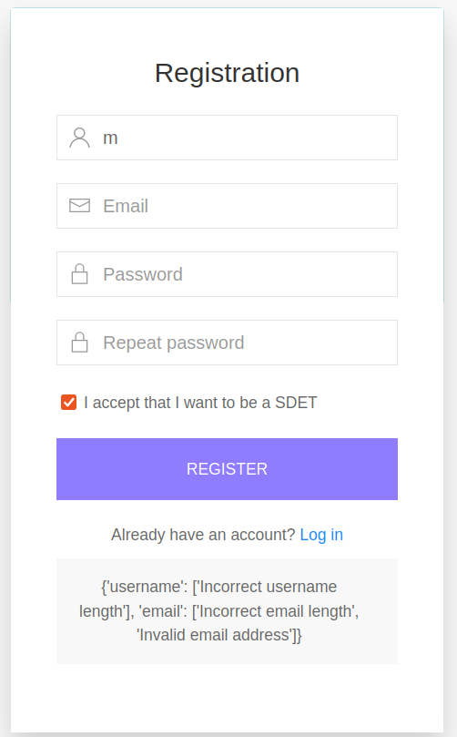
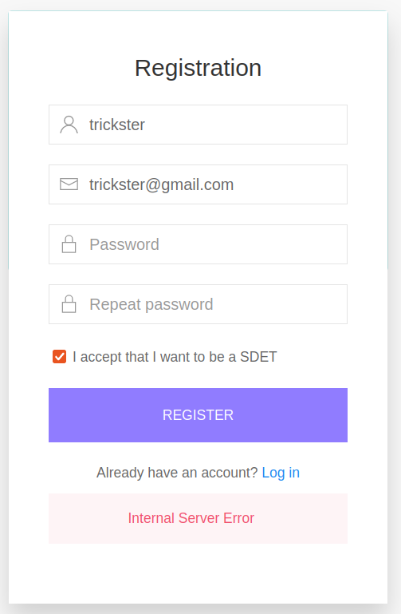

# Финальный проект

## Api

- Удаление через GET-запрос

```
GET http://<APP_HOST>:<APP_PORT>/api/del_user/<username>
```

- Код 210 вместо 201
- Отсутствие валидации пустого логина, пустого пароля, невалидного или занятого email

## UI

- История Python  открывается не в новой вкладке, а поверх приложения

- Некорректная ссылка на загрузку CentOS

- Отсутствие проверки на занятый логин

- Некорректное уведомление при множественных ошибках регистрации



- 500 ошибка при повторении email при регистрации



